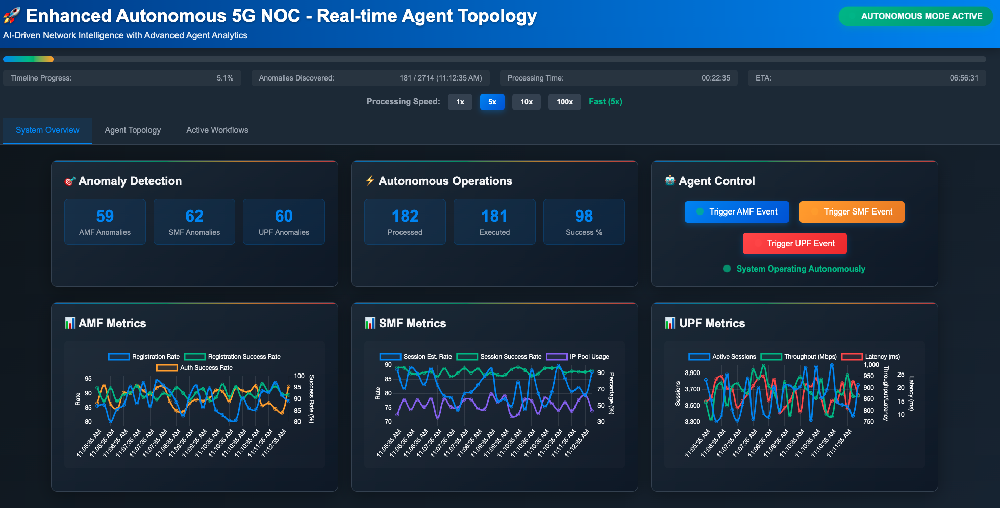
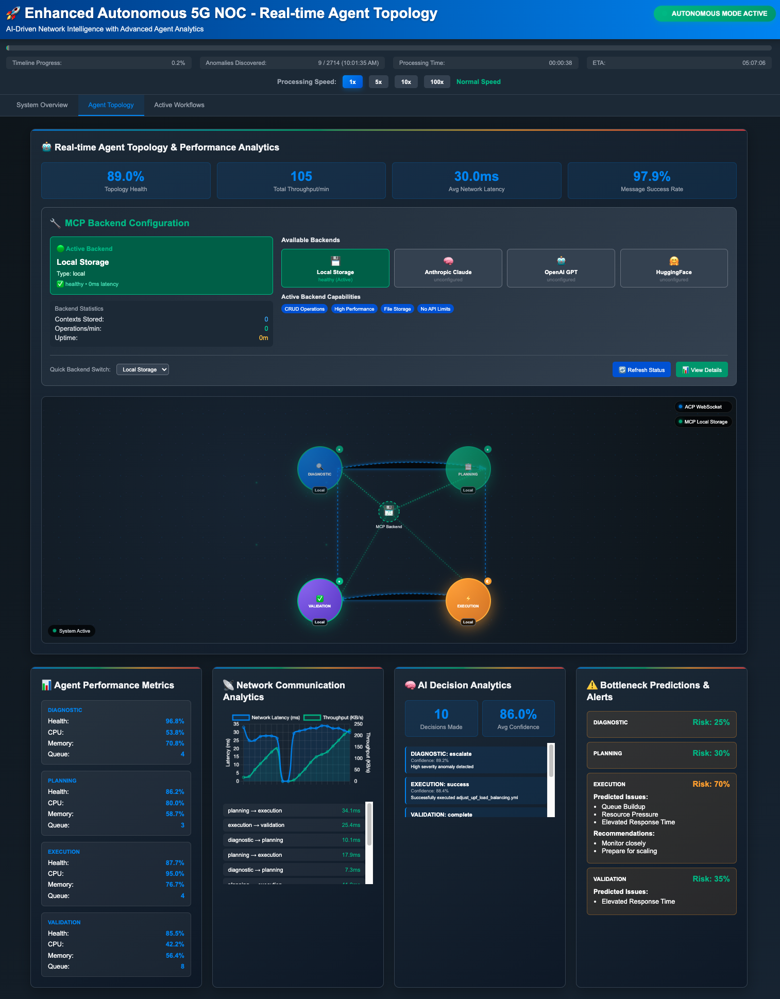
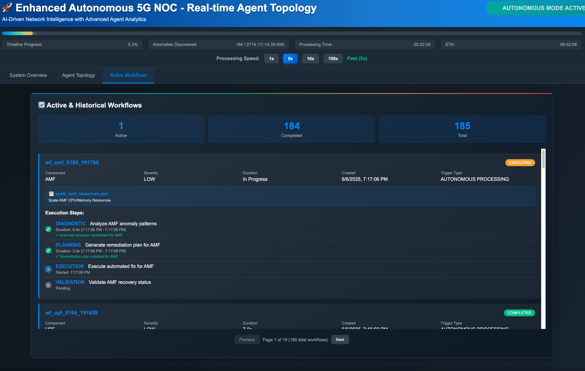

# 🤖 Autonomous 5G Network Operations - Real Agentic Framework

## 🚀 Overview

A ** autonomous 5G network operations system** featuring distributed AI agents, real-time anomaly detection, and autonomous remediation. The system uses genuine agent-to-agent communication protocols (ACP/MCP) with live orchestration for monitoring AMF, SMF, and UPF components.

**🎥 Demo Video1**: [Watch on YouTube](https://www.youtube.com/watch?v=nQlEBPeQ1hk)
**🎥 Demo Video2**: [Watch on YouTube] (https://youtu.be/plUdrp0YNz8)
---

## ✨ Key Features

### 🤖 **Real Agentic Framework**
- **Autonomous AI Agents**: Four specialized agents with real communication protocols
- **Agent Communication Protocol (ACP)**: WebSocket-based inter-agent messaging
- **Model Context Protocol (MCP)**: HTTP-based context and data sharing
- **Dynamic Orchestration**: Central orchestration service for task delegation and workflow coordination
- **Agent Discovery**: Real-time agent registration and capability discovery

### 🔍 **Intelligent Operations**
- **Real-time Anomaly Detection**: Continuously monitors 5G network components (AMF, SMF, UPF)
- **Autonomous Remediation**: Agents collaborate to diagnose, plan, execute, and validate fixes
- **Timeline Processing**: Replay historical data with adjustable speed (1x-100x)
- **Predictive Analytics**: ML-powered anomaly prediction and trend analysis

### 📊 **Advanced Visualization**
- **Live Agent Topology**: Real-time visualization of agent interactions and communication flows
- **Performance Metrics**: Live charts for registration rates, session establishment, throughput, and latency
- **Workflow Tracking**: Detailed view of active and historical autonomous workflows
- **Health Monitoring**: Agent performance metrics and communication status

---

## 🏗️ **Real Agentic Architecture**

```
┌──────────────────────────────────────────────────────────────────────────┐
│                         🎯 Orchestration Service                         │
│                     (Workflow Coordination & Discovery)                  │
└─────────────────────────┬────────────────────────────────────────────────┘
                          │ Task Delegation
                          ▼
    ┌─────────────────────────────────────────────────────────────────────┐
    │                    🌐 Communication Protocols                       │
    │  ACP Broker (WebSocket)    │    MCP Server (HTTP Context)           │
    └─────────────┬───────────────────────────────┬───────────────────────┘
                  │                               │
                  ▼                               ▼
┌─────────────────────────────────────────────────────────────────────────┐
│                        🤖 Autonomous Agents                             │
├─────────────────┬─────────────────┬─────────────────┬───────────────────┤
│  🔍 Diagnostic  │  📋 Planning    │  ⚡ Execution    │  ✅ Validation    │
│     Agent       │     Agent       │     Agent       │     Agent         │
│                 │                 │                 │                   │
│ • Anomaly       │ • Remediation   │ • Playbook      │ • Result          │
│   Analysis      │   Strategy      │   Execution     │   Verification    │
│ • Pattern       │ • Resource      │ • Automation    │ • Performance     │
│   Recognition   │   Planning      │   Tasks         │   Validation      │
│ • ML Models     │ • Impact        │ • Rollback      │ • Health Check    │
│ • MCP Server    │ • MCP Server    │                 │ • MCP Server      │
└─────────────────┴─────────────────┴─────────────────┴───────────────────┘
                  │                               │
                  ▼                               ▼
┌─────────────────────────────────────────────────────────────────────────┐
│               📊 Enhanced NOC Dashboard (Real-time)                     │
│   Agent Topology • Live Metrics • Workflow Status • Performance         │
└─────────────────────────────────────────────────────────────────────────┘
```

### 🔄 **Autonomous Workflow Process**

1. **🔍 Diagnostic Agent** (`diagnostic-001`)
   - Analyzes anomaly patterns using ML models
   - Communicates findings via ACP WebSocket protocol
   - Provides context to other agents via MCP

2. **📋 Planning Agent** (`planning-001`)
   - Receives diagnostic data from orchestration service
   - Generates remediation strategies and resource plans
   - Coordinates with execution agent for implementation

3. **⚡ Execution Agent** (`execution-001`)
   - Executes Ansible playbooks autonomously
   - Monitors execution progress and handles failures
   - Reports status to orchestration service

4. **✅ Validation Agent** (`validation-001`)
   - Verifies remediation effectiveness
   - Monitors system health post-execution
   - Triggers rollback if validation fails

---

## 🛠️ **Technical Stack**

### **Core Framework**
- **Language**: Python 3.8+ (Async/Await)
- **Protocols**: ACP (WebSocket), MCP (HTTP)
- **Communication**: FastAPI, aiohttp, WebSockets
- **Orchestration**: Custom orchestration service with agent discovery
- **Data Processing**: Pandas, NumPy, Scikit-learn

### **Infrastructure**
- **Automation**: Ansible playbooks
- **Deployment**: RHOCP 4.18+, RHOAI Operator 2.20+
- **Storage**: Vector databases (FAISS), Pickle serialization
- **Frontend**: Modern web dashboard with real-time updates

---

## 📋 **Prerequisites**

### **Platform Requirements**
- **RHOCP**: 4.18+
- **RHOAI Operator**: 2.20+
- **Python**: 3.8+
- **Ansible**: Latest version
- **Browser**: Chrome, Firefox, Safari (modern)

### **Network Requirements**
- **Port 30080**: Web dashboard
- **Port 8765**: ACP broker (WebSocket)
- **Port 3000**: MCP server (HTTP)

---

## 🚀 **Quick Start**

### **1. Clone Repository**
```bash
git clone https://github.com/yourusername/Telco-AIX.git
cd Telco-AIX/autonetv2
```

### **2. Install Dependencies**
```bash
pip install -r requirements.txt
```

### **3. Launch Agentic System**
```bash
python main.py --data-path processed_data --playbook-dir playbooks
```

### **4. Access Dashboard**
Navigate to: **http://localhost:30080**

---

## 🌐 **Dashboard Features**

### **📊 System Overview**
- Real-time anomaly statistics
- Agent health and communication status  
- Timeline processing controls (1x-100x speed)
- Network component health (AMF, SMF, UPF)



### **🤖 Agent Topology**
- Interactive agent network visualization
- Real-time communication flows
- Agent performance metrics
- Protocol status (ACP/MCP)



### **🔄 Active Workflows**
- Live workflow execution status
- Agent interaction timelines
- Remediation progress tracking
- Historical workflow analysis



---

## ⚙️ **Configuration**

### **Real Agent System**
The system automatically detects and initializes real agents with:
- **Agent IDs**: `diagnostic-001`, `planning-001`, `execution-001`, `validation-001`
- **Protocols**: ACP (ws://localhost:8765), MCP (http://localhost:3000)
- **Orchestration**: Automatic agent registration and task delegation

### **Ansible Playbooks**
Place remediation playbooks in `playbooks/` directory:

```yaml
# Example: scale_amf_resources.yml
---
- name: Scale AMF Resources Autonomously
  hosts: amf_nodes
  gather_facts: yes
  tasks:
    - name: Increase CPU allocation
      shell: |
        # Your autonomous remediation logic
        echo "Scaling AMF resources based on agent analysis"
    
    - name: Verify scaling completion
      wait_for:
        timeout: 60
        msg: "AMF scaling completed"
```

### **Available Playbooks**
- `scale_amf_resources.yml` - Autonomous AMF scaling
- `restart_smf_service.yml` - SMF service restart
- `adjust_upf_load_balancing.yml` - UPF load balancing
- `resource_optimization.yml` - General optimization

---

## 🐳 **RHOCP Deployment**

### **Service Configuration**
```yaml
apiVersion: v1
kind: Service
metadata:
  name: agentic-dashboard
  namespace: tme-aix
spec:
  ports:
    - name: dashboard
      port: 30080
      targetPort: 30080
    - name: acp-broker  
      port: 8765
      targetPort: 8765
    - name: mcp-server
      port: 3000  
      targetPort: 3000
  selector:
    statefulset: tme-aix-wb01
```

### **Route Configuration**
```yaml
apiVersion: route.openshift.io/v1
kind: Route
metadata:
  name: agentic-dashboard
  namespace: tme-aix
spec:
  path: /
  to:
    kind: Service
    name: agentic-dashboard
  port:
    targetPort: 30080
```

---

## 🛡️ **Architecture Benefits**

### **Real Autonomous Operation**
- ✅ **True Agent Communication**: No simulation - real WebSocket/HTTP protocols
- ✅ **Dynamic Discovery**: Agents register and discover capabilities automatically  
- ✅ **Fault Tolerance**: Graceful degradation when agents are unavailable
- ✅ **Scalability**: Add new agent types without code changes

### **Production Ready**
- ✅ **Protocol Standards**: Industry-standard ACP/MCP protocols
- ✅ **Service Mesh**: Distributed agent architecture
- ✅ **Observability**: Full agent communication monitoring
- ✅ **Integration**: RESTful APIs for external system integration

---

## 📈 **Monitoring & Observability**

### **Agent Metrics**
- Communication latency and throughput
- Task completion rates and success ratios
- Agent health and availability status
- Protocol-specific performance metrics

### **System Metrics**
- Anomaly detection accuracy and response times
- Workflow execution duration and success rates  
- Resource utilization and optimization impact
- Network component health trends

---
