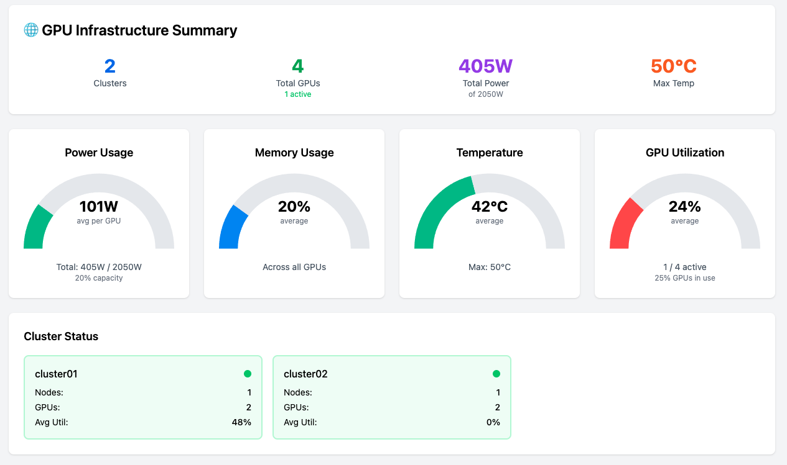
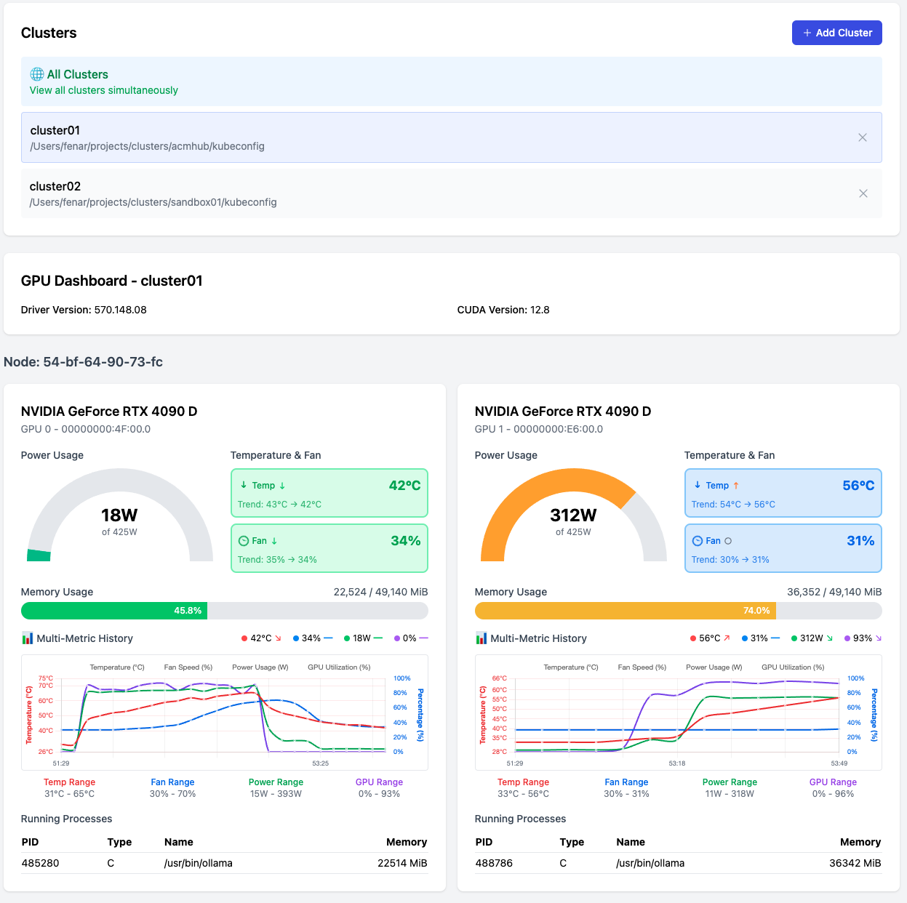

# 🖥️ GPU Console - Multi-Cluster GPU Monitoring Dashboard

A comprehensive real-time GPU monitoring dashboard for Kubernetes clusters with NVIDIA GPU Operator support. Monitor GPUs across multiple clusters with interactive visualizations, persistent metrics, and executive summary views.



## ✨ Features

### 🎯 **Multi-Cluster Support**
- Monitor GPUs across unlimited Kubernetes clusters
- Single-pane-of-glass view for all infrastructure
- Individual cluster deep-dive mode
- Executive summary dashboard with gauges

### 📊 **Real-time Visualizations**
- **Multi-metric time series charts** with 4 metrics in one view:
  - 🌡️ Temperature monitoring with trend indicators
  - 🌀 Fan speed tracking 
  - ⚡ Power usage with capacity indicators
  - 🎯 GPU utilization percentage
- **Interactive hover tooltips** with detailed status information
- **Persistent data storage** survives page reloads
- **Configurable retention** (5-1440 minutes)

### 🚀 **Advanced Features**
- **Executive Dashboard**: High-level gauges for infrastructure overview
- **Process Monitoring**: View running GPU processes with memory usage
- **Smart Status Indicators**: Color-coded health status (🔥 HOT, ⚠️ WARM, ✅ COOL)
- **Responsive Design**: Works on desktop, tablet, and mobile
- **Automatic Data Management**: TTL-based cleanup and storage optimization

### ⚙️ **Management Tools**
- **Cluster Management**: Add/remove clusters via UI
- **Metrics Settings**: Configure data retention and storage
- **Storage Statistics**: View data usage and cleanup tools
- **Error Handling**: Graceful failover and connection management

## 🛠️ Tech Stack

### Backend
- **Node.js** 18+ with TypeScript
- **Express.js** - REST API server
- **Socket.io** - Real-time WebSocket communication
- **@kubernetes/client-node** - Kubernetes API integration
- **CORS** enabled for cross-origin requests

### Frontend  
- **React 18** with TypeScript
- **Vite** - Fast build tool and dev server
- **Chart.js** with react-chartjs-2 - Interactive charts
- **Tailwind CSS** - Utility-first styling
- **Heroicons** - Beautiful SVG icons
- **Axios** - HTTP client for API calls

### Storage & Persistence
- **localStorage** - Browser-based metrics persistence
- **TTL-based cleanup** - Automatic data expiration
- **JSON configuration** - File-based cluster management

## 📋 Prerequisites

### System Requirements
- **Node.js** 18.0.0 or higher
- **npm** 8.0.0 or higher
- **Modern browser** with localStorage support

### Kubernetes Infrastructure
- **Kubernetes clusters** with NVIDIA GPU Operator installed
- **kubeconfig files** with appropriate permissions
- **nvidia-driver-daemonset** pods in specified namespace (default: `nvidia-gpu-operator`)
- **kubectl access** to execute commands in GPU pods

### Permissions Required
The kubeconfig files must have permissions to:
- List pods in the GPU namespace
- Execute commands in nvidia-driver-daemonset pods
- Access pod logs (optional for debugging)

## 🚀 Quick Start

### 1. Clone and Install
```bash
# Clone the repository
git clone <repository-url>
cd gpu-console

# Install all dependencies (both backend and frontend)
npm run install:all
```

### 2. Configure Clusters
Edit `config/clusters.json` with your cluster information:
```json
[
  {
    "name": "production-cluster",
    "kubeconfigPath": "/home/user/.kube/prod-config",
    "namespace": "nvidia-gpu-operator"
  },
  {
    "name": "staging-cluster", 
    "kubeconfigPath": "/home/user/.kube/staging-config",
    "namespace": "nvidia-gpu-operator"
  }
]
```

### 3. Start the Application
```bash
# Start both backend and frontend servers
npm start

# Or use the convenient script
./run-servers.sh
```

### 4. Access Dashboard
- **Frontend**: http://localhost:5173
- **Backend API**: http://localhost:3001
- **Health Check**: http://localhost:3001/api/clusters

## 🐳 Docker Deployment

### Using Docker Compose
```bash
# Build and start containers
docker-compose up -d

# View logs
docker-compose logs -f

# Stop containers
docker-compose down
```

### Manual Docker Build
```bash
# Build the image
docker build -t gpu-console .

# Run container
docker run -d \
  -p 3001:3001 \
  -v /path/to/kubeconfigs:/app/kubeconfigs:ro \
  -v /path/to/config:/app/config \
  gpu-console
```

## ⚙️ Configuration

### Environment Variables
```bash
# Backend Configuration
PORT=3001                    # Backend server port
NODE_ENV=production         # Environment mode

# Frontend Configuration  
VITE_API_BASE_URL=http://localhost:3001  # Backend URL for frontend
```

### Cluster Configuration
The `config/clusters.json` file supports these options:
```json
{
  "name": "cluster-display-name",           // Unique cluster identifier
  "kubeconfigPath": "/path/to/kubeconfig",  // Absolute path to kubeconfig
  "namespace": "nvidia-gpu-operator"       // Kubernetes namespace (optional)
}
```

### Metrics Storage Configuration
Access via the ⚙️ settings icon in the dashboard:
- **Data Retention**: 5-1440 minutes (default: 30 minutes)
- **Max Data Points**: 50 per GPU (automatic cleanup)
- **Storage Location**: Browser localStorage
- **Cleanup**: Automatic on startup and configurable

## 📚 API Reference

### Cluster Management
```http
# Get all configured clusters
GET /api/clusters

# Add a new cluster
POST /api/clusters
Content-Type: application/json
{
  "name": "new-cluster",
  "kubeconfigPath": "/path/to/kubeconfig",
  "namespace": "nvidia-gpu-operator"
}

# Remove a cluster
DELETE /api/clusters/{cluster-name}
```

### GPU Data
```http
# Get GPU information for a specific cluster
GET /api/clusters/{cluster-name}/gpus

# Response format
[
  {
    "clusterName": "production",
    "timestamp": "2024-01-01T12:00:00.000Z",
    "nodeName": "gpu-node-1", 
    "gpus": [
      {
        "index": 0,
        "name": "NVIDIA GeForce RTX 4090",
        "temperature": 65,
        "fanSpeed": 45,
        "powerUsage": 285,
        "powerCap": 450,
        "memoryUsed": 8192,
        "memoryTotal": 24576,
        "gpuUtilization": 75,
        "processes": [...]
      }
    ],
    "driverVersion": "525.60.13",
    "cudaVersion": "12.0"
  }
]
```

## 🏗️ Architecture

### System Overview
```
┌─────────────────┐    ┌─────────────────┐    ┌─────────────────┐
│   Web Browser   │◄──►│  Frontend App   │◄──►│  Backend API    │
│                 │    │  (React/Vite)   │    │ (Node.js/Express)│
└─────────────────┘    └─────────────────┘    └─────────────────┘
                                                      │
                                               ┌─────────────────┐
                                               │ Kubernetes API  │
                                               │   (via kubectl) │
                                               └─────────────────┘
                                                      │
                                               ┌─────────────────┐
                                               │ nvidia-smi pods │
                                               │  (GPU metrics)  │
                                               └─────────────────┘
```

### Data Flow
1. **Cluster Detection**: Backend loads cluster configs on startup
2. **GPU Discovery**: Finds nvidia-driver-daemonset pods in each cluster
3. **Metrics Collection**: Executes nvidia-smi commands via kubectl
4. **Data Processing**: Parses output into structured JSON
5. **API Serving**: Provides REST endpoints for frontend
6. **Real-time Updates**: HTTP polling every 5 seconds
7. **Persistent Storage**: Browser localStorage with TTL cleanup

### Component Structure
```
frontend/src/
├── components/
│   ├── ClusterSelector.tsx          # Cluster selection UI
│   ├── ClusterSummaryDashboard.tsx  # Executive summary gauges
│   ├── GPUDashboard.tsx            # Individual cluster view
│   ├── GPUCard.tsx                 # Single GPU visualization
│   ├── MetricsSettings.tsx         # Settings modal
│   └── visualizations/
│       ├── MultiMetricChart.tsx    # 4-in-1 time series chart
│       ├── PowerGauge.tsx         # Doughnut chart for power
│       ├── MemoryBar.tsx          # Progress bar for memory
│       └── TemperatureIndicator.tsx # Status boxes with trends
├── hooks/
│   ├── useGPUData.ts              # Single cluster data fetching
│   └── useMultiClusterGPUData.ts  # Multi-cluster data fetching
├── services/
│   └── api.ts                     # HTTP client for backend
└── utils/
    └── metricsStorage.ts          # localStorage persistence
```

## 🔧 Development

### Prerequisites for Development
```bash
# Install Node.js (using nvm recommended)
nvm install 18
nvm use 18

# Verify installation
node --version  # Should be 18.x.x
npm --version   # Should be 8.x.x
```

### Development Workflow
```bash
# Install dependencies
npm run install:all

# Start development servers with hot reload
npm run dev

# Backend only (port 3001)
cd backend && npm run dev

# Frontend only (port 5173)  
cd frontend && npm run dev

# Build for production
npm run build

# Run type checking
npm run type-check

# Run linting
npm run lint
```

### Project Scripts
```bash
# Root package.json scripts
npm run install:all    # Install all dependencies
npm start             # Start production servers
npm run dev           # Start development servers
npm run build         # Build both apps for production
npm run clean         # Clean node_modules and builds

# Backend scripts (cd backend)
npm run dev           # Start with nodemon hot reload
npm run build         # Compile TypeScript to JavaScript
npm run start         # Start compiled production server

# Frontend scripts (cd frontend)  
npm run dev           # Start Vite dev server
npm run build         # Build optimized production bundle
npm run preview       # Preview production build locally
```

## 🐛 Troubleshooting

### Common Issues

#### "Connection Refused" Errors
```bash
# Check if backend is running
curl http://localhost:3001/api/clusters

# Check backend logs
cd backend && npm run dev

# Verify port availability
lsof -i :3001
```

#### "Cannot find kubeconfig" Errors
- Verify kubeconfig paths are absolute, not relative
- Check file permissions (readable by Node.js process)
- Test kubeconfig manually: `kubectl --kubeconfig=/path/to/config get pods`

#### "No GPU data" Issues
- Verify nvidia-gpu-operator namespace exists
- Check nvidia-driver-daemonset pods are running
- Test nvidia-smi manually in cluster:
  ```bash
  kubectl exec -it nvidia-driver-daemonset-xyz -- nvidia-smi
  ```

#### Frontend Build Errors
```bash
# Clear node_modules and reinstall
npm run clean
npm run install:all

# Check Node.js version
node --version  # Must be 18+

# Update TypeScript if needed
cd frontend && npm update typescript
```

#### Performance Issues
- **Too many clusters**: Limit to <10 clusters for optimal performance
- **Large datasets**: Adjust retention time in settings (⚙️ icon)
- **Memory usage**: Clear browser localStorage if needed
- **Network latency**: Check cluster connectivity and kubectl performance

### Debug Mode
```bash
# Enable debug logging
export DEBUG=gpu-console:*
npm start

# Frontend debug (browser console)
localStorage.setItem('debug', 'gpu-console:*')
```

## 📊 Monitoring & Metrics

### Available Metrics
- **Temperature**: GPU core temperature (°C)
- **Fan Speed**: Fan speed percentage (%)
- **Power Usage**: Current power draw (W) vs Power Cap (W)
- **GPU Utilization**: GPU compute utilization (%)
- **Memory Usage**: VRAM used vs total (MB)
- **Process Information**: Running processes with memory usage

### Metric Collection
- **Frequency**: Every 5 seconds
- **Source**: nvidia-smi command execution
- **Storage**: Browser localStorage with TTL
- **Retention**: Configurable 5-1440 minutes
- **Cleanup**: Automatic expired data removal

### Dashboard Views
1. **Executive Summary**: High-level gauges for all clusters
2. **Individual Cluster**: Detailed cards for each GPU
3. **Multi-Metric Charts**: Time series with 4 metrics combined
4. **Process Monitoring**: Real-time process lists

---

## 🚀 Quick Commands

```bash
# Get started immediately
git clone <repo> && cd gpu-console && npm run install:all && npm start

# Docker deployment
docker-compose up -d

# Development mode
npm run dev

# Production build
npm run build && npm start
```

**Happy GPU Monitoring! 🖥️📊**
