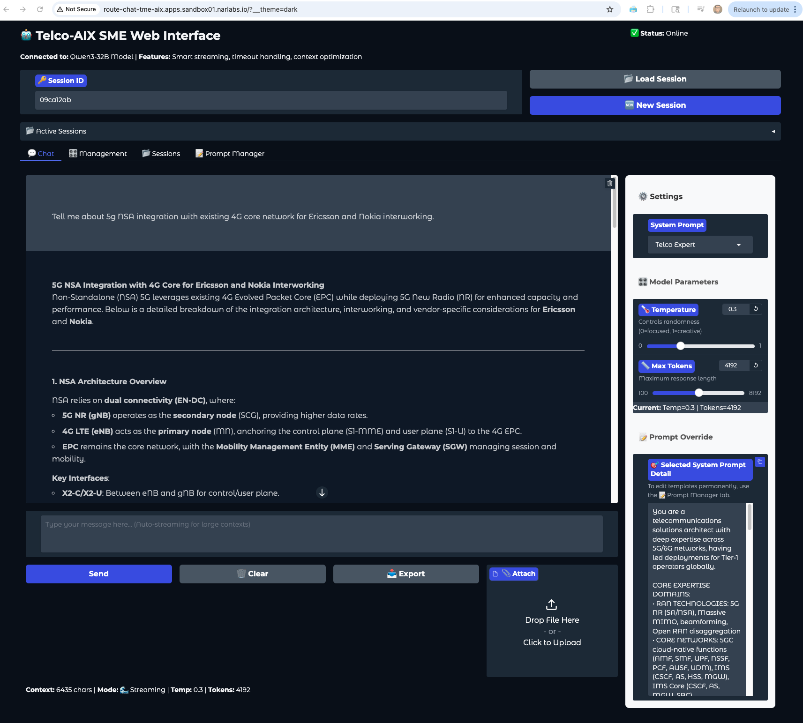

# Telco-AIX SME Web Interface



## Overview
The Telco-AIX SME (Subject Matter Expert) Web Interface is a sophisticated chat application designed for telecommunications professionals. It provides AI-powered conversations with specialized knowledge in telco technologies, network architecture, and technical solutions.

## Features

### 🤖 **AI-Powered Conversations**
- **Multiple Expert Personas**: Choose from specialized system prompts for different domains
- **Intelligent Responses**: Context-aware AI with telecommunications expertise
- **Smart Streaming**: Automatic streaming for large contexts and responses
- **File Upload Support**: Attach and analyze technical documents

### 📂 **Persistent Sessions**
- **Session Management**: Create, load, and manage conversation sessions
- **Browser Refresh Resilience**: Never lose conversation progress
- **Session Sharing**: Share session IDs for collaboration
- **Auto-Save**: All conversations and settings automatically saved
- **24-Hour Retention**: Sessions persist for 24 hours with automatic cleanup

### ⚙️ **Advanced Configuration**
- **Temperature Control**: Adjust AI creativity (0=focused, 1=creative)
- **Token Limits**: Configure response length up to 8192 tokens
- **System Prompts**: 8 specialized expert personas plus custom options
- **Real-time Settings**: All parameters update dynamically

### 🎯 **Expert Domains**
1. **Default Assistant** - Systematic problem-solving approach
2. **Network Expert** - Network architecture and SDN/NFV
3. **Telco Expert** - 5G/6G, RAN, Core networks, standards
4. **Cloud Expert** - Cloud Tech Expert
5. **Storage Expert** - Storage Matters

## Installation

### Prerequisites
- Python 3.8 or higher
- Required packages (see requirements.txt)

### Setup
1. Clone or download the repository
2. Install dependencies:
   ```bash
   pip install -r requirements.txt
   ```
3. Run the application:
   ```bash
   python sme-web-ui.py
   ```
4. Access the web interface at: `http://localhost:30180`

### Authentication
- **Username**: `admin`
- **Password**: `minad`

## Usage

### Getting Started
1. **New Session**: Leave Session ID empty or click "🆕 New Session"
2. **Load Session**: Enter existing Session ID and click "📂 Load Session"
3. **Select Expert**: Choose appropriate system prompt from dropdown
4. **Configure Settings**: Adjust temperature and max tokens as needed
5. **Start Chatting**: Type your message and press Enter or click Send

### Session Management
- **Session IDs**: 8-character unique identifiers (e.g., "a1b2c3d4")
- **Persistence**: Sessions survive browser refreshes and server restarts
- **Recovery**: Enter session ID to continue previous conversations
- **Cleanup**: Expired sessions automatically removed after 24 hours

### File Uploads
- **Supported Formats**: .txt, .md, .csv, .json, .py
- **Size Limit**: 3,500 characters to prevent timeouts
- **One-time Use**: Files apply only to current message, not subsequent ones

## System Prompts Configuration

### External File Loading
System prompts are loaded from `system_prompts.json`, making it easy to customize AI personas without code changes.

### File Structure
```json
{
    "Prompt Name": "Detailed prompt content with role, expertise, and methodology...",
    "Another Expert": "Another specialized prompt..."
}
```

### Management Features
- **Dynamic Reload**: Reload prompts without restarting
- **UI Editor**: Create and edit prompts directly in the web interface
- **Export/Import**: Manage prompts through JSON file editing
- **Validation**: Automatic syntax checking and error handling

### Adding Custom Prompts
1. Go to "📝 Prompt Manager" tab
2. Enter prompt name and detailed content
3. Click "💾 Save Prompt"
4. Prompt immediately available in dropdown

## Architecture

### Components
- **SessionManager**: File-based session persistence using pickle
- **ChatClient**: HTTP client with streaming support and retries
- **ChatInterface**: Main UI logic and event handling
- **SystemPrompts**: Dynamic prompt loading and management

### Technical Features
- **Smart Context Management**: Automatic streaming for large contexts
- **Retry Logic**: Robust error handling with exponential backoff
- **Thread Safety**: Concurrent request handling with processing locks
- **Memory Optimization**: Context size limits and history management

### File Structure
```
├── sme-web-ui.py           # Main application
├── system_prompts.json     # Expert persona definitions
├── sessions/               # Session storage directory (auto-created)
├── requirements.txt        # Python dependencies
├── webui.png              # Web interface screenshot
└── README.md              # This documentation
```

## Configuration

### Environment Variables
Serving Selected Model Qwen3-32B Full Model that runs on RHOAI-ModelServing with vLLM RunTime with NVIDIA Acceleration. We have tested with Single RTX 6000 Blackwell 96GB Card.

- Model-Car Image URI: `oci://docker.io/efatnar/modelcar-qwen3-32b:latest`
- Default API endpoint: `https://qwen3-32b-vllm-latest-tme-aix.apps.sandbox01.narlabs.io`
- Model: `qwen3-32b-vllm-latest`
- Port: `30180`
- SSL verification disabled for development environments

### Customization
- Edit `Config` class in `sme-web-ui.py` for API endpoints
- Modify `system_prompts.json` for expert personas
- Adjust timeout and retry settings as needed

## Troubleshooting

### Common Issues
- **Connection Problems**: Check API endpoint and network connectivity
- **Session Loading**: Verify session ID format (8 characters)
- **Prompt Errors**: Validate JSON syntax in system_prompts.json
- **Performance**: Reduce context size or max tokens for faster responses

### Diagnostics
1. Go to "🔧 Diagnostics" tab
2. Click "🔍 Run Diagnostics" to test all connections
3. Check console output for detailed error information

### Session Management
- **List Sessions**: View all active sessions with details
- **Cleanup**: Remove expired sessions manually
- **Backup**: Session files stored in `sessions/` directory

## Development

### Key Files
- `sme-web-ui.py`: Main application with all classes and UI
- `system_prompts.json`: Expert persona definitions
- `requirements.txt`: Python package dependencies


**Note**: This interface is designed for professional telecommunications use cases and requires appropriate model access and configuration.
